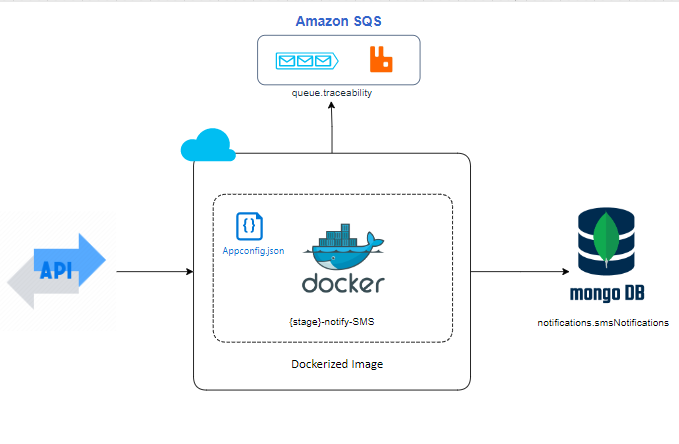

## Notify-SMS

#### Descripción

Este servicio se encarga de recibir peticiones GET, POST y DELETE para la creacion de notificaciones que leugo podrian ser procesadas en otro servicio que se encargue de realizar los envios y actualizar los estados, para la peticion DELETE de hecho se tiene como premisa el no ser borrada si el mensaje ya fue enviado al cliente.

#### Diagrama de componentes

En el siguiente diagrama de componentes se muestra el diseño de la integración y la relación con los diferentes componentes:

|**Nombre Componente**|**Descripción del componente**|**Responsabilidad**|**Tipo**|**Herramienta**|
|---------------------|------------------------------|-------------------------------------------------|--------| -------------------- |
|AppConfig|File|Archivo ubicado en la raíz de directorio, contiene la configuración inicial para que el servicio pueda iniciar|JSON|Notepad|
|Trazabilidad|RabbitMQ|Se encolaran los mensajes de trazabilidad de cada evento del Servicio|Log|Notepad|
|MongoDB|tabla de datos|Contendra los datos de cada notificacion registrada |BD|NOSQL|

#### Características técnicas del servicio

- Microservicio desarrollado para NetCore 7.0
- Puede ejecutar en docker / iis / consola

#### Manejo de Errores

|                | **Si/No** | **Cómo se realiza**                                    |
| -------------- | --------- | ------------------------------------------------------ |    
| Reintentos     | No        |                                                        |
| Trazabilidad   | Si        | En RabbitMQ                                            |

**Descripción de las definiciones: Configuracion en appsettings.json**

**MongoDB:** Define los parametros de configuracion de MongoDB.

**RabbitMQ:**: Define los parametros necesarios para el envio de los mensajes de trazabilidad en RabbitMQ.

**Traceability**: Define los modos de envios de trazabilidad, permite habilitar y deshabilitarla.

